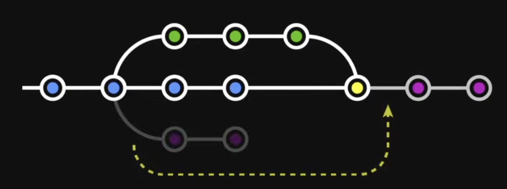

# Git

- Git은 VCS중 하나이다.
    > VCS : Version Control System
- 협업할 팀원 추가
    > repository의 settings - Collaborators - Add People
---

#### Commands
##### Base
- `git status` : git의 상태 볼 수 있다.
- `git log` : 지난 commit 기록들을 볼 수 있고, j와 k로 스크롤 가능.
- `git commit -am 'blahblah'` : 새로 추가된 파일이 없을 때만 사용 가능한 add + commit 기능의 명령어 `-am`이다.

---
##### Reset vs Revert
- `git reset --hard (hashcode)` : 특정시점의 hashcode를 통해 그 특정시점으로 `reset`한다.
- `git revdert (hashcode)` : 특정 시점의 hashcode를 통해 그 특정시점으로 `revert`한다.
- `git rm (filename)` : git에서 file을 삭제한다.
- `git revert --continue` : `revert`중 충돌문제 때문에 멈춰 있던 `revert`를 이어서 실행한다.
- `git revert --no-commit (hashcode)` : `revert`와 함께 다른 추가작업을 시행했다면 `commit`도 해줘야 하지만, 이 명령어는 `revert`와 `commit`을 동시에 할 수 있게 한다.

---
##### Branch & Switch
- `git branch (branch name)` : branch를 생성한다.
- `git branch` : branch 목록을 확인한다.
- `git switch (branch name)` : branch를 이동한다.
- `git switch -c (branch name)` : 새 branch를 생성하고 이동한다.
- `git branch -d (branch name)` : branch를 삭제한다. (-D (대문자)옵션을 사용할 경우 다른 branch로 적용되지 않은 커밋내용을 무시하고 강제 삭제한다.)
- `git branch -m (이름변경할branch) (변경될branch)` : branch이름을 변경한다.
- `git switch (branch name)` : 다른 branch로 이동

---
##### Merge vs Rebase
- `git merge (branch name)` : 현재 위치한 branch**로** (branch name)branch를 `merge`한다.
- `git rebase (branch name)` : 현재 위치한 branch**를** (branch name)branch를 rebase한다. **`merge`와 반대이다!**
- `git merge --abort` : `merge`중 충돌이 발생하여 더 이상 `merge`를 진행하고 싶지 않을 때 `merge`를 중단시킨다.
- `git rebase --abort` : 위와동
- `git rebase --continue` : 충돌내용을 수정한 후 `git add .`으로 변경사항을 추가하고 나머지 `rebase`과정을 계속 진행시킨다.

---

#### Reset vs Revert
- `Reset` : 특정 과거 시점으로 돌아간 후 그 이후의 기록들을 모두 날려버리는 것.
- `Revert` : 특정 과거 시점(A)에 대한 역실행 commit 내역(-A)을 추가한 다음, 결과적으로 그 특정 시점(A)으로 돌아가는 것.
    > 이 경우, 그 시점(A) 이후(B, C, ...)의 다른 내역들은 유지된다.

---

#### Merge vs Rebase
- `Merge` : 두 가지를 이어붙이고 그 과정에서 `commit`하나가 더 생겨난다.
    - history에 branch의 흔적을 남긴다.
    - branch의 사용내역들을 남겨둘 필요가 있으면 `Merge`를 사용하라.
    - `merge`도 하나의 `commit`이기 때문에 `reset`으로 되돌리기가 가능하다.
    - 충돌 발생 시 충돌부분을 수정한 후 다시 `commit`한다.

    > <git_fig1>
- `Rebase` : 작업한 내용을 다른 곳의 뒤에 이어붙이는 작업이다.
    - history에 흔적을 남기지 않는다.
    - history를 깔끔하게 만드는 것이 중요하다면 `Rebase`를 사용하라.
    - 협업 중에는 `Rebase`를 사용하는 것을 지양하라.
    - `rebase`한 후에는 `merge`를 통해서 rebase branch를 합치고 제거해주어라.
    - 충돌 과정 해결한 후 원래 main과 비교하여 변경사항이 없다면 `commit`하지 않는다.

    > <git_fig2>

---

