## 8/18
- `echo %PATH%` : 환경변수의 경로 조회(?)
- . : 현재폴더
- .. : 상위폴더
<br>
###### `C:\Users\bitcamp>a.exe`
- 현재 경로에서 찾는다.
- OS의 PATH환경 변수에 등록된 경로를 순서대로 찾는다.
- Unix의 경우 현재 경로를 명시해야 한다.
    ex) `./a.exe`
    (PATH환경 변수에 등록된 경로를 따라가며 찾기 때문이다.)

- `a.exe` 파일 : 컴파일 된 기계어 명령의 실행파일
    - 실행 시에 `.exe` 부분은 생략가능
    > _순서_
    > 1. a.com 찾는다
    > 2. a.exe 찾는다
    > 3. a.bat 찾는다
    - `.com`과 `.exe`는 기계어 파일
        > .bat은 OS가 이해하는 스크립트로 작성된 명령어가 들어있는 파일 << 컴파일 불필요!
    - `a.doc` 등은 기계어 파일이 아니다! >> 직접실행불가!
        > .doc 확장자와 연결된 프로그램을 실행
        > 그 프로그램이 `a.doc` 파일을 읽는다.

- Unix 에서는 실행파일에 대해 사용자가 실행권한을 가지고 있어야만 실행할 수 있다.
`$ls -al`
`rw-r--r-- a` : 644
`rw-` : user권한
`r--` : group권한
`r--` : other 권한
`a` : 실행파일명
1. 실행파일에 대해 사용자에게 실행권한을 부여하지 않았기 때문에 실행할 수 없다.
2. 실행권한 부여 : `$chmod 744 a`
3. `744` : 111_100_100 (= rwx r-- r--) ->> **_실행권한을 2진수로 표현_**
4. `$a` : 드디어 실행할 수 있다.

---

* `implements Iterable` 이라면
> for (Member m : **list**) {} 에 사용할 수 있다.

---

- `HashSet`이 중복여부를 검사할 때 `hashCode()`와 `equals()`의 리턴값으로 판단한다.(&&조건을 만족)
- `Object`의 `hashCode()`는 인스턴스가 다르면 무조건 다른 해시값을 리턴한다.
- `Object`의 `equals()`는 인스턴스의 주소가 같은 지 검사한다.

---

#### HashSet vs HashMap
##### HashSet
    - HashSet << == >> 객체
1. `HashSet`이 객체에게 `hashCode()`를 요구하고
2. 객체는 해시값을 리턴하고
3. 저장하려는 객체의 해시값을 가지고 위치를 선정한다.
- 값을 꺼낼 때
    > 임의의 순서로 꺼낸다.
    > 특정 객체를 콕 집어서 꺼낼수가 없다.

##### HashMap
    - HashSet << == >> key-value
1. 위와동
2. 위와동
3. 저장하려는 객체의 해시값이 아닌, 그 객체의 key의 해시값을 가지고 위치선정
- 값을 꺼낼 때
    > key를 가지고 특정 객체를 콕 집어서 꺼낼 수 있다.
- 같은 키로 다른 값을 저장하면 기존 값을 덮어쓴다.
- key는 **객체**여야 한다.
    > `int`는 안되지만 `Integer`는 가능하다.

---

- `keySet()`을 호출할 때 모든 key를 미리 목록을 만들어 리턴하지 않는다.
- `iterator`를 얻은 후에는 값을 변경하지 않아야 한다.
- 결론
    > key나 value에 null을 사용하고 싶다면 HashMap을 사용하라.
    > key나 value가 null이 되어서는 안된다면 Hashtable을 사용하라.

---

#### 향상된 for문
    > for (Member m : members)
- 향상된 for문은 컬렉션과 배열(이들 또한 `iterable`구현체이다), `iterable`인터페이스를 구현한 객체라면 무엇이든 사용할 수 있다.
- 향상된 for문으로 컬렉션 데이터를 처리할 때, 컬렉션은 수정할 수 없다.

---

## 8/19
- Proxy 패턴을 활용한 네트워킹 코드 캡슐화
    > 캡슐화 : 해당 기능이 필요한 경우 간단히 메서드 호출로 처리

1. Proxy 패턴
    > `Client >> _call_ >> **통신대행자** >> _통신_ >> Server`
    > `Client << _리턴_ << **통신대행자** << _결과_ << Server`
    - 통신대행자 : 통신코드를 감춘다.

- Proxy 패턴 적용 이전
    > **BoardHandler** << 통신 >> **BoardServlet**
- Proxy 패턴 적용 이후
    > **BoardHandler** << call, return >> **BoardDaoProxy** << 통신 >> **BoardServlet**

---

##### stateful => stateless (= Connection-Oriented = 연결지향 = **TCP**)
- stateful 방식
    > - 연결을 끊을 때까지 나머지가 대기해야 하는 줄서기 방식
    > : 은행 업무
    > - FTP, POP3, 채팅, 게임
- stateless 방식
    > - [연결>>요청>>응답>>연결끊기]를 반복하는 방식
    > : 114, ARS 인증
    > - HTTP
##### TCP 방식이 아닌 Connectionless 방식(= **UDP**)
    > : 편지, 방송
    > ping

## 8/22
- **"Remote Object"** : 실제 Data를 저장하고 꺼내는 일을 하는 객체 `BoardDao`
    - **"Skeleton"** : Remote Object의 서버측 대행자 `BoardServlet`
        > Server 측 ORB (Object Request Broker)
    - **"Stub"** : Remote Object의 클라이언트 쪽 대행자 `BoardHandler`
        > Client 측 ORB (Object Request Broker)

---

- 분산시스템 아키텍처
    > server를 회계전담서버, 인사전담서버, ... 등으로 나누다보니 시스템 간 기능호출이 필요하다
    > 이 때문에 **원격메서드호출**이 필요하다.

- 원격메서드 호출기술과 진화과정
    1. RPC (Remote Procedure Call)
        > - 원격 메서드를 만드는 개발자에게 부담이 가중되어서
        > 호출 대행자 생성을 자동화 했다.
        > - '메서드 생성기'를 통해 코드를 자동생성
    2. RMI (Remote Method Invocation)
        > - 객체 생성기가 코드를 자동 생성한다.
        > `skeleton`과 `stub`의 코드를.
    3. 
    - EJB(Enterprise Java Beans) `Beans (=Object)`
        > only java만 가능
    -  CORBA (Common Object Request Broker Architecture)
        > 언어중첩 : 언어에 구애받지 않고 호출할 수 있게 해준다.
    4. Web Service Architecture : `EJB+CORBA (+웹통신+XML)`
        > - WSDL : Web Service Description Language : 호출함수 원격 객체의 메서드 정보
        > - WSDL을 클라에게 응답/ 사용할 stub을 서버에게 요청/ stub을 다운로드/
        > - 이후 stub과 skeleton은 HTTP에 따라 통신
        > - **Eclipse IDE 등은 개발도구에서 stub 객체를 자동으로 다운로드 한다.**
        > **개발자가 직접 다운로드 하지 않는다.**
    5. RESTful API : `4.에서 추가로 순수 HTTP 기술 사용`
        > - 개발도구를 사용하여 sub을 자동 다운로드 하더라도 결국 client측에서는 stub객체를 사용해야 한다.
        > - 또한 프로그래밍 언어에 맞춰 stub을 다운로드 해야한다.
        > - 이를 해결하려고 순수 HTTP 기술 사용 `프로그래밍 언어별로 stub이 필요없다.`

    - Thread를 이용한 멀티태스킹 구현 : 동시 요청 처리하기
        > ServerApp : 프로세스
        > RequestThread : 실행흐름을 분리
    
    ---

    - IP주소 `v4의 경우 : 32bit 양의 정수 값`
        > 1. `C0A8004A` (16진수)
        > 2. `3,232,235,594` (10진수)
        > 3. `192.168.0.74` (표현하기 쉽게 1byte씩 잘라서 10진수로 표기)
        > 4. `localhost` (기억하기 쉽게 이름을 부여)
        > IP주소를 직접 사용하는 대신에 IP주소에 부여된 알파벳과 숫자로 된 텍스트 이름을 사용하는 것이 편하다.
        > IP주소에 대한 텍스트 이름을 알려주는 서버가 "**DNS**"

## 8/23
- proxy 서버 역할
    > 1. 필터링 >> 접근제어
    > 2. 로깅(logging) >> 사용기록
    > 3. 캐싱(caching) >> 임시 보관

- 통신을 하는 모든 프로그램은 port번호를 가져야 한다.
- client 의 port번호는 OS로부터 자동 발급 받는다. `49152 ~ 65535`

---

- Application은 결국 OS의 메서드 호출 >> 실행 시 OS의 영향을 받는다.

---

- LAN Card = NIC (Network Interface Card)

---

- 버퍼 사용시 입출력
    > 버퍼가 꽉 찼을 때 입출력하기 때문에 server-client 간 데이터전송이 원활하게 이루어지지 않는다.
- 해결법
    > `flush()`를 실행하여 출력을 명령한다.

---

- byte Stream : inputStream, ...
- character Stream : Reader, Writer, ...

---

##### TCP/IP
- packet에 관하여~
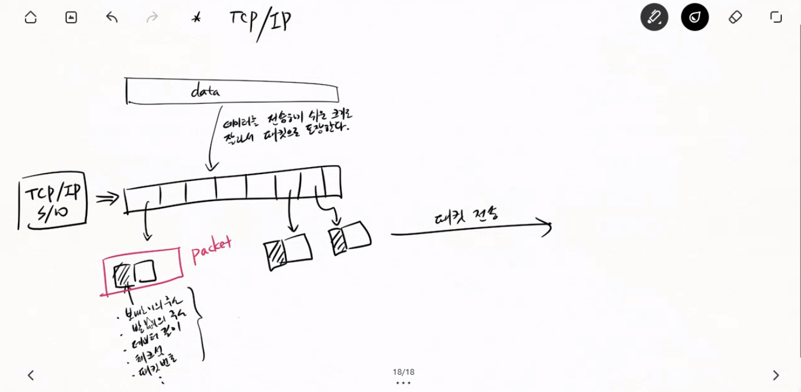
`<fig1>`

---

- Collaboration Diagram
    > Sequence Diag.
    > 시간 흐름에 따라 실행과정을 표현하기에 적합

## 8/24
- Node.js 는 싱글스레드로 되어 있다.
- 자바스크립트를 실행하는 스레드는 하나뿐이므로 Node를 싱글스레드라고 한다.
- 그 싱글스레드는 이벤트 루프이다.

---

- Connection-Oriented vs Connectionless
    > Connection-Oriented : TCP (연결지향)
    > - stateful
    > - stateless
    > ServerSocket, Socket

    > Connectionless : UDP (비연결)
    > DatagramSocket, DatagramPacket
    > 편지, ping

- URI (Uniform Resource Identifier) :: URL, URN
    - URL : Uniform Resource Locator
        > `scheme(프로토콜)://<user(사용자id)>:<password(암호)>@<host(서버주소)>:<port(포트번호)>/(path)(자원의경로)<url-path(query string)>`
        > - id와 암호는 생략가능
    - URN : Uniform Resource Name
        > `example:animal:ferret:nose`

- 정적자원(Static Resources)과 동적자원(Dynamic Resources)
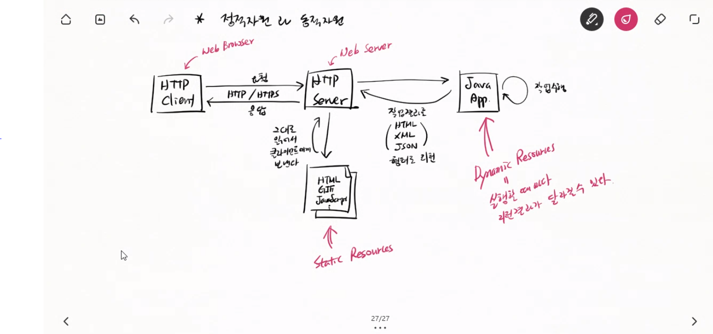
`<fig2>`

---

- VM (Virtual Machine)
    > Host OS 위에 Guest OS를 설치하는 모양새.
    > 가상머신은 실제컴퓨터처럼 H/W 자원을 사용 :: 자원낭비가 심하다.
    > 그래서...(아래)
- Docker
    > App을 실행하는데 필요한 H/W 자원만 사용
    > 물론 VM처럼 별도의 컴퓨터에서 실행하는 것처럼 동작

---

- 멀티 태스킹
> 여러 작업을 순차적으로가 아니라 동시에 수행

- concurrent
> 마치 동시에 실행하는것처럼 빠르게 왔다갔다 하는것. (!= parallel)

1. 멀티 프로세싱
    > 프로세스(process) : 실행중인 프로그램
    > 프로세스를 복제(fork)해서 멀티태스킹 수행
    > code가 중복로딩, heap 중복생성 :: 메모리 많이 사용
2. 멀티 스레딩
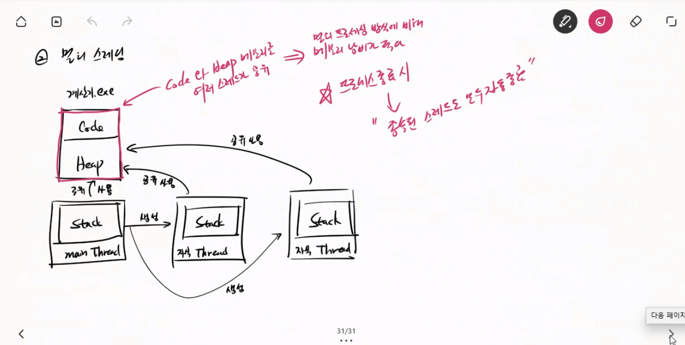
`<fig3>`

    > code와 heap 메모리를 여러 스레드가 공유
    > :: 멀티 프로세싱 방식에 비해 메모리 낭비가 적다.
    > 프로세스 종료 시 :: 종속된 스레드도 모두 자동 종료
    > 프로세스와 스레드를 동일하게 간주하여 동시 실행한다.
    
- cpu가 프로세스나 스레드의 명령을 실행할 떄, cpu실행을 분배하는 전략?
`cpu를 어떤식으로 분배해서 명령을 처리할 것인가?`
`"cpu scheduling"`
    > 1. windows :: Round Robin :: 프로세스와 스레드에 동일 시간 분배
    > 2. unix :: Priority + Aging :: (우선순위가 높은 프로세스나 스레드를 더 많이 실행) + (우선순위가 낮아 실행이 밀릴 때마다 우선순위를 높여서 다음 번엔 실행될 수 있게 하는 것)

- Context Switching
`cpu가 다른 프로세스나 스레드를 실행하기 위해 현재 프,스의 실행상태(여기까지 실행했다)를 저장하고  실행할 프,스의 실행상태(어디서부터 실행하나?)를 로딩하는것`
`cpu스케쥴링 시간을 너무 짧게 잡으면 명령을 실행하는 시간보다 context switching에 더 많은 시간을 소비하는 문제가 발생한다 :: 너무 간극을 크게 잡으면 동시실행 효과가 떨어진다.`

---

`cpu : L1(명령어 저장소) + L2(data 저장소)`

---

## 8/25
- `enumerate(parameter)` : 하위 스레드 그룹의 목록을 알아본다.
- `getParent()` : 상위 스레드 그룹을 알아본다.
- `t.start()` : 별도의 실행흐름을 만든 후 `run()`을 호출한다. 그리고 즉시 리턴한다. `run()`실행이 끝날때까지 기다리지 않는다. **:: 비동기 실행 (Asynchronous)**

######스레드 구현하기
1. Thread 클래스 상속받기
    > - 가장 간단하다.
    > - 다중 상속이 불가능하기 떄문에, 다른 클래스를 상속받으면서 스레드를 상속받을 수 없다.
2. Runnable 인터페이스 구현하기
    > 많이 사용되는 방법
    > 위와 사용법은 같다.

## 8/26
- main 스레드가 먼저 종료되어도 다른 스레드가 종료될 때까지 JVM은 종료되지 않는다.
- Thread의 생명주기(lifecycle)
    > 1. 준비 : start()를 통해 Running상태로 돌입
    > 2. Running : cpu스케쥴링 대상 = cpu를 받을 수 있는 상태
    > 3. Not Runnable : cpu를 안 받는 상태 = cpu스케쥴링 대상에서 제외
    > 4. Dead : run()메서드 실행 완료, 다시 Running상태로 갈 수 없다.

---

- cpu racing (cpu 쟁탈전)
    > 여러 프로세스나 스레드들이 cpu 사용권을 놓고 경쟁하는 것.
    > 그러나 사실은 OS가 cpu 스케쥴링 정책에 따라 결정하고 표현만 이렇게 한다.

---

#### Critical Region(Critical Section)

- 여러 스레드가 동시에 코드를 실행할 떄 문제가 발생하는 코드 블록을 "**Critical Region**" 또는 "**Critical Section**"이라 부른다.
> 왜 이런 문제가 발생하는가?

- 같은 메모리(변수)에 동시에 접근하여 값을 변경할 때, 다른 스레드가 쓴 값을 덮어 쓸 수 있기 때문이다.
> 어떻게 해결할 수 있는가?

- <u>한 번에 한 스레드 만</u>이 접근하도록 제한하면 된다
 `Mutual Exclusion (상호배타)` = `Mutex`
 자바에서는 Mutex를 문법으로 지원!
- 상호 배제 기법
`Semaphore(n)` : <u>n개 까지만 허용, 나머지는 배제</u>
    `semaphore(1) = Mutex`

---

- `thread safe` : 여러 스레드가 동시에 실행해도 문제가 없는 코드 블록

---

- **`synchronized` 문법**
`synchronized (객체명) {}` : {}안에서 동시에 접근할 수 없는 객체를 ()에 선언해준다.

---

#### Database
- 데이터 공유
- 일관성, 무결성, 보안성
- 데이터 중복 최소화
- 실시간 접근 가능
- etc

---

#### DBMS :: Database를 관리
- Database 관리
- 다중 client 요청 처리
- 접속자 인증/권한검사
- etc

> Oracle - Oracle DBMS
> MS - MS-SQL
> IBM - DB2
> Oracle - MySQL >>오픈소스>> **MariaDB**
> 개발커뮤니티 - MariaDB
> 한국 - Cubrid, Altibase, Tibero, ...

---

#### SQL (Structured Query Language)
- 구조를 갖춘, DBMS에 명령을 내릴 때 사용하는 문법
- 각 DBMS의 명령문법을 표준화한것(?)
- SQL표준문법 외에도 DBMS마다 전용 문법이 있다.
    > 왜?
    > :: 각자 장단점이 있다.
    > :: DBMS만의 특별기능을 사용할 문법이 필요.

---

## 8/29
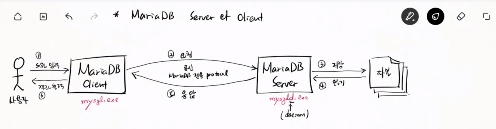
`<fig4>`

- SQL 명령 전달?
    > 서버에는 SQL 명령을 입력받는 UI가 없다.
    > 사용자가 입력한 SQL을 서버에게 전달해줄 App을 사용(Client)

1. 사용자 등록
    `create user '(name)'@'(localhost)' identified by '(password)';`
2. 데이터베이스 생성
    `create database (database name) character set (utf8) collate (utf8_general_ci);`
3. 사용자가 접근할 수 있는 데이터베이스 권한 부여
    `grant all on (studydb.*) to '(name)'@'(localhost)';`

- `desc studydb.test01;` : table정보 확인
- `use studydb;` : 사용할 database명(import와 동일기능)
- `show tables;` : table들 보여줌.(MariaDB용)
- `insert into test1(no, name) values (1, 'aaa');` : 데이터를 입력한다. 문자를 입력할 때 single quotation을 권고한다.

---

##### SQL
##### DDL (Data Definition Language)
    > 테이블, 뷰, 함수, 트리거 등을 생성, 변경, 삭제하는 SQL 명령
    1. 테이블 정의
        > create table studydb.test01 (
            name varchar(50) not null,
            kor int not null,
            eng int not null,
            math int not null,
            sum int not null,
            aver float not null);

    2. 테이블에 데이터 입력
        > insert into test1(no, name) values(1, 'aaa');

    3. 테이블에 들어있는 데이터 조회
        > select no, name from test1;

- table, row, column
    > row : 행, `record`, `tuple`
    > column : 열, `attribute`
    > table : `entity`

- numeric
    > 전체 자릿수와 소수점 이하의 자릿수를 정밀하게 지정할 수 있다.
    > numeric(n,e) : 전체 n 자릿수 중에서 소수점은 e 자릿수다.
        > 예) numeric(10,2) : 12345.1211 => 12345.12
    > numeric : numeric(10, 0) 과 같다.

- PK (primary key)
    - 테이블의 데이터를 구분할 때 사용하는 컬럼들이다.
    - 줄여서 PK라고 표시한다.
    - PK 컬럼을 지정하지 않으면 데이터가 중복될 수 있다.

- 인공키 (Artificial key)
    - 오로지 key로만 사용할 목적으로 만들어진 column

- 대안키 (Alternate key)
    - PK는 아니지만 PK처럼 중복되어서는 안되는 컬럼을 지정할 때 사용한다.
    - 대안키는 DBMS에서 unique 컬럼으로 지정한다.

## 8/30
- create view
    > 따로 table을 만드는 것이 아니다.
    > 단축키를 만드는 것이다.
    > 가상의 table처럼 작동해서 sql문을 줄일 수 있다.

---
- commit / rollback :: 트랜잭션을 다룬다.
    - insert, update, delete, ...
    - 이들을 한 단위로 묶어서 처리해야 하는 경우가 있다.
        > ex) 구매할 제품 inesert + 결제정보를 insert
    - 여러 개의 DML 작업을 한 단위로 묶는다.
    **"Transaction"이라 부른다.**
    - 그 단위에 묶인 작업이 모두 성공할 때만 업무가 완성된다.

---
- key - 데이터를 구분하는 식별자
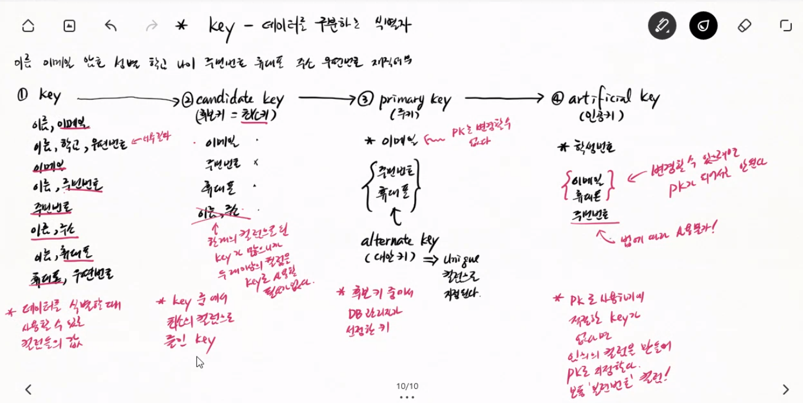
`<fig5>`

---
##### DQL (Data Query Language)
>데이터 조회 언어 :: Query : 조회

---
- "Projection" : 결과로 추출할 컬럼을 지정
- "Selection" : 특정 조건의 데이터를 선택
    > ex) select no, name from teset1 where no > 10;
    - no, name :: projection 대상
    - where no > 10 :: selection 조건

---
## 8/31
- DBMS와 파일저장
    1. 파일저장1 ::
        > [DBMS에 파일저장]
        > - 데이터베이스가 매우 커진다.
        > - 데이터베이스 파일 안에 파일을 저장/로드
        > => 파일 I/O이 느리다.
    2. 파일저장2 ::
        > [DBMS에는 파일의 경로만 저장 + 파일은 서버에 저장]
        > - 실제 파일 I/O은 OS에서 처리
        > - I/O 속도 빠르다.
        > - DBMS 부담이 줄어든다.

- DBMS에 파일을 저장하는 사례
    1. 사용자가 그림이 포함된 콘텐트를 저장할 때
        > 그림의 크기가 작을 때(1MB 안팎)
        > 콘텐트에 포함된 전체 그림들의 크기가 너무 크지 않을 때(10MB 이내)
    2. 그림파일의 데이터를 텍스트로 변환하여 콘텐트 전체를 텍스트로 만든다.
    3. 그림 데이터가 포함된 텍스트를 테이블에 저장한다.

- 웹브라우저가 그림을 읽는 과정
    ```
    그림 >>"base64 인코딩'>> 텍스트 >>"base64 디코딩">> 그림
    ```
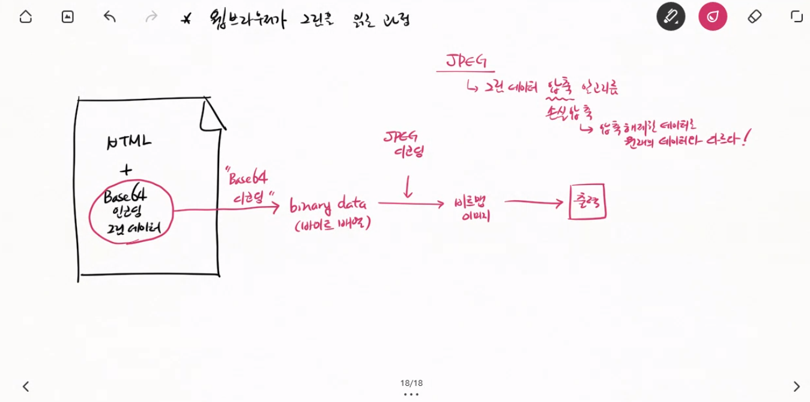
`<fig6>`

!!! <memo> Base64 인코딩/디코딩
    - 단지 바이너리 데이터를 저장할 뿐이다. ( = 데이터 손실이 일어나지 않는다.)
    - 이미지를 바이너리로 직접 저장하면 데이터베이스가 너무 커진다.

---
- 첨부 파일이 있는 게시글을 다루기
    1. 한 개의 테이블 사용
        > 문제점
        > - 첨부 파일의 경로가 최대 5개로 제한된다.
        > - 첨부 파일이 없는 경우 컬럼만 낭비된다.
    2. 첨부파일 정보를 별도의 테이블로 분리
        > 첨부파일의 정보를 별도의 테이블로 분리
        > - 개수에 제한이 없다.
        > - 첨부 파일이 없는 경우 메모리 절약

---
- File System -> 파일 정보를 다루는 시스템

|파일명|크기|사용섹터정보...|
|:---:|---|---|
|a.txt|513 byte|1, 2|
|x.gif|320 byte|3|
|ok.pdf|5300 byte|6,7,9,10,11,15,17,18,21,22,27|
|...|...|...|

위의 표를 '1.'이라 한다. (Windows OS의 파일 시스템에서)
1. **F**ile **A**llocation **T**able (FAT)
    > +파일명을 최대 255자 + a
2. FAT32
    > +디렉토리/파일에 접근권한 설정 + b
3. NTFS

---
- ER Diagram (Entity Relationship Diagram)
    > 테이블(Entity) 간의 관계를 표현하는 표기법
    1. IE 표기법 (Information Engineering Notation)
    2. ??

- DML (Data Manipulation Language)
    > 데이터 조작 언어 :: DQL+DML 묶어서 DML이라고도 한다.

---
## 9/1
- sha2 함수 : 원상태로 복구할 수 없는 단방향 암호화
반드시 이렇게 하세요

- join : 여러 테이블에 분산 저장된 데이터를 한 개의 데이터로 모으는 것

- select 문에서
    - `select all ~` : 평상시 사용하는 옵션 (생략가능)
    - `select distinct ~` : 중복을 제거한다. 컬럼이 여러개일 경우 레코드값 전체를 기준으로한다.

- union : 두 집합의 합집합을 의미한다. (중복을 제거한다.)
- union all : 두 집합의 결과를 하나로 합치지만 중복 제거를 하지 않는다.
- minus : 차집합 (Oracle 은 가능하지만 MySQL은 불가능!)
대신 `not in` 절이 있다
- intersect : 교집합 (Oracle 은 가능하지만 MySQL은 불가능!)
대신 `in` 절이 있다
- join : 여러 테이블에 분산 저장된 데이터를 한 개의 데이터로 모으는 것
    - cross join( = cartesian join) : 기본 join : 모든 데이터를 연결시킨다.
    의미없는 조인
    - natural join : 우리가 원하는 join이지만... : 같은 이름을 가진 컬럼을 기준으로 레코드를 연결한다.
    `select m.mno, name, s.mno, work, bank from memb m, stnt s where m.mno=s.mno;`
    - inner join ~ on : on뒤의 기준 컬럼의 값이 일치할 때만 데이터 연결 
    - left(right) outer join : 


- group by 와 having : group by 와 함꼐 쓸 수 있는 함수 : sum, average, count, ...

- 오라클 실행순서
**from - where - group by - having - select - order by**

- MariaDB 실행순서
**from - where - group by - having - select - order by**

---
## 9/2
- key에 대한 개념도
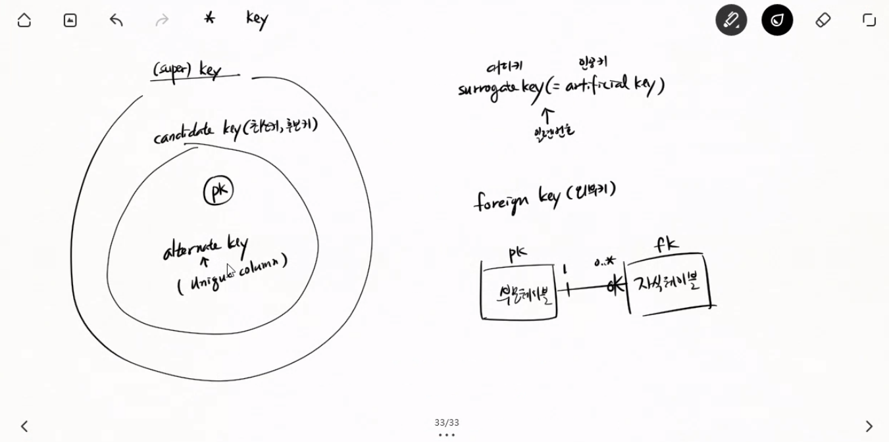
`<fig7>`

---
- 논리 모델링
    - 개념 모델링
    - 자연어로 작성
- 물리 모델링
    - DBMS에 맞춰서 논리 모델링을 변경
    - 가이드라인에 따라 테이블명과 컬럼명 작성

---
- DB 모델링 절차
    1. 업무 분석 : 업무전문가(Business 도메인전문가)
    2. 데이터베이스 모델링 : DB설계자
        1. 엔티티(테이블) 및 속성(컬럼) 식별

---
- 부모-자식 관계 : 식별관계 vs 비식별관계
    - 비식별관계 (non-identifying) : FK != PK
    - 식별관계 (identifying) : FK = PK

---
- 다대다 관계의 해소
    - 다대다 관계를 표현하는 "**관계 테이블**" 을 정의!
    - 다대다 관계의 중간에 테이블을 따로 하나 만들어서 `[다대다]의 폼을 [일대다, 다대일]의 폼으로` 만든다.

---
- 관계 차수
    - `1 : 0..*` : 일대다 관계, 우측 테이블은 반드시 하나의 관계를 맺는다.
    - `0,1 : 0..* : ` : 우측 테이블의 FK컬럼의 값이 null이면 좌측 테이블과 관계를 맺지 않는다.
```
    - 1    : *  (0이상)    => FK 컬럼이 not null 이다.
    - 1    : 1..* (1이상)  => FK 컬럼이 not null 이다.
    - 0,1  : *  (0이상)    => FK 컬럼이 null 허용이다.
    - 0,1  : 1..* (1이상)  => FK 컬럼이 null 허용이다. 
```

---
- 포함관계 : `erd는 이 관계를 그릴 수 없다.`
    - 배타적 관계 : 슈퍼타입의 엔티티가 반드시 하나의 서브타입에만 속하는 관계
    - 포함 관계 : 슈퍼타입의 엔티티가 두 개 이상의 서브타입에 포함될 수 있는 관계


---
- 모든 데이터가 `not null`인 테이블을 "**마스터 테이블**" 이라고 한다.
- MDA(Model Driven Architecture) : 모델 구동형 아키텍처
    > 모델링을 먼저 하고 그걸 코드로 구현한다(?)

---
## 9/5
#### JDBC
1. DBMS Native API 등장
    - DBMS Client 역할, 사람이 사용하는 것이 아니라, App이 사용
    - `DBMS API : App에서 DBMS Server에게 SQL을 보낼 때 사용하는 메서드`
        - DBMS Native API : DBMS 제조사가 제공해준다.
        - 언어별로 제공
    - 문제발생 ::
        - DBMS에 맞춰 App을 개발해야 한다.
        - DBMS에 종속된다.
        - 똑같은 코드를 중복해서 개발해야 하는 문제도 발생.

2. ODBC API (**O**pen **D**ata**B**ase **C**onnectivity)
    - :: DBMS API의 표준 규격
    - 규격에 따라 만든 API :: `~~ SQL ODBC Driver`
    - API 규격이 같기 때문에 메서드 호출 코드도 동일하다
    => DBMS마다 변경할 필요가 없다.

3. JDBC API (**J**ava **D**ata**B**ase **C**onnectivity)
    - java에서 c/c++기반인 odbc를 직접 호출할 수 없다.
    => Java에서 DBMS와 연결할 자바전용 API가 필요!
    - `java에서 DBMS와 연결할 때 사용하는 객체의 호출규격을 정의한 것`
    => `interface`
    - **JDBC Driver** : 규격에 따라 클래스와 메서드를 구현한 것
    - **Type 1 Driver**
        - ODBC API를 호출하는 JDBC Driver
        - Local에 ODBC API 설치 필요
        - "ODBC-JDBC Bridge 드라이버"
        - JRE에 기본으로 포함되어 있다.

4. JDBC API : **Type 2 Driver**
    - :: "JDBC Native Call 드라이버"
    - 각 DBMS의 Native API를 호출한다.
    - ODBC API 사용하지 않음.
    - Local에 DBMS API 설치 필요
    - DBMS Vendor로부터 다운로드 받아야 한다.

- Type1이든 Type2든 둘 다 JDBC API 규격에 따라 작성되었기 때문에 사용법이 같다.
=> Java App을 변경할 필요가 없다.

5. JDBC API : **Type 3 Driver**
    - DBMS가 변경되면 Native API/ODBC API + Type2 Driver 변경해야 한다.
    - DBMS에 종속되는 문제를 **중간서버** :: "**Middleware(미들웨어)**"를 이용해서 해결했다.
    - DBMS를 바꾸더라도 Local쪽은 변경할 필요가 없다.
    - Local에는 DBMS와 관련된 파일을 설치할 필요가 없다.
    - :: "**네트워크 드라이버**"

6. JDBC API : **Type 4 Driver**
    - local에 ODBC API/Native API를 설치할 필요가 없다.
    - JDBC Driver만 설치한다. => "**Pure Java**"
    - DBMS서버와 직접 통신
    - DBMS Vendor에 다운로드 해야한다.
    - DBMS 변경되면 Driver도 변경해야 한다.
    - :: "**DBMS Protocol Driver**"

---
#### JDBC Programming
- JDBC API
    - java.sql.*
    - javax.sql.*

1. JDBC Driver 다운로드
2. 프로젝트 classpath에 추가
3. JDBC API 규칙에 따라 call

---
#### JDBC Programming 절차
1. `java.sql.Driver` 구현체 준비
=> JDBC Driver에 대한 정보를 갖고 있다.
2. `java.sql.DriverManager` 에`Driver 구현체` 등록
3. `DriverManage`를 통해 `java.sql.Connection` 객체 얻기
=> DBMS와의 연결정보 갖고있다.`
4. `Connection`을 통해 `java.sql.Statement/PreparedStatement` 객체를 준비시킨다. `<= SQL을 서버에 보내고 응답을 받는 일을 한다.`
5. `Statement/PreparedStatement` 를 통해 `java.sql.Resultset`을 얻는다.
=> DBMS의 select 결과를 한 개씩 가져오는 일을 한다.

- 참고 자료
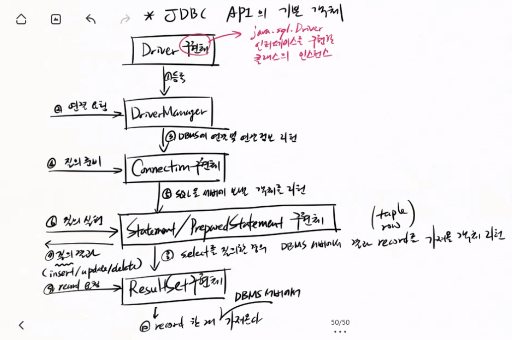

---
###### 클래스 로딩
1. `new 클래스();` : 인스턴스를 생성할 때
2. `클래스.스태틱필드 = 값;` : 스태틱 필드를 사용할 때
3. `클래스.스태틱메서드();` : 스태틱메서드를 호출할 때
4. `Class.forName("패키지.클래스");` : 명시적으로 코딩 :: "**fully-qualified class name" = "FQName" = "QName"**

---
###### argument
`java -Dname=aaa -Dage=30 Hello aaa bbb ccc`
- program argument : `aaa bbb ccc`
- VM argument : `-Dname=aaa -Dage=30`

---
- META-INF / java.sql.Driver : 이 '부가정보'라는 폴더 아래에 '클래스'파일에 대한 정보가 있다.
- `service-provider loading`규칙에 따라 자동으로 드라이버를 로딩한다.
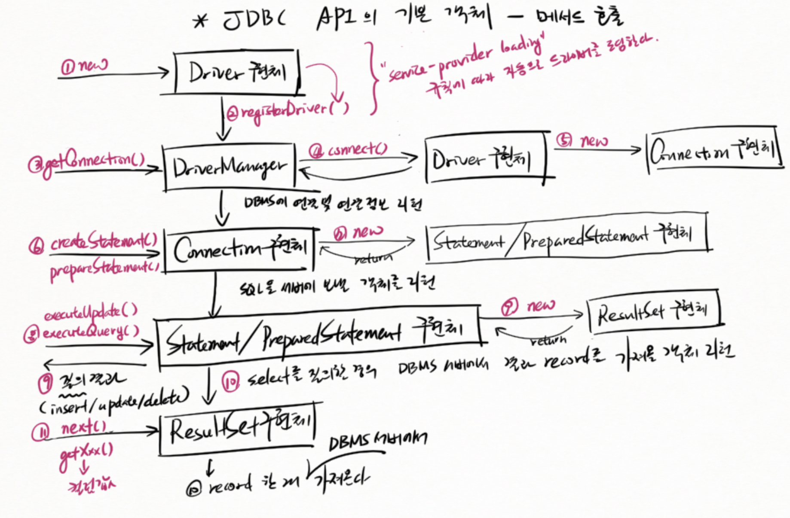

---
## 9/6
- `jdbc:mariadb://localhost:3306/studydb` : jdbc url
- `jdbc:mariadb://localhost:3306/studydb?user=study&password=1111` : `?`를 기준으로 `user=study`와 `password=1111`로 한줄로 입력가능하다.

- ResultSet 객체는 결과가 들어오는 객체가 아니라 서버에서의 실행 결과를 1개 가져오는 객체이다.
- ResultSet 객체에 대해 next()를 호출하면 boolean 값 리턴한다.
- 컬럼번호는 배열번호와 달리 1번부터 시작한다!
- DAO (**D**ata **A**ccess **O**bject) : 데이터 처리를 담당하는 객체
- `RETURN_GENERATED_KEYS` : 이 insert문을 실행한 후에 자동으로 생성된 primary key 값이 있다면 그 값을 받겠다.

---
###### autocommit의 문제점
- 여러 데이터를 한번에 입력하다가 중간에 오류가 발생했을 경우
1. < autocommit >
```
    - 오류발생 직전까지 실행되지만 그 이후는 실행못한다
        - 이전에 입력한 데이터는 그대로 유지된다.
        - executeUpdate()를 실행할 때마다 자동으로 commit하기 때문이다.

    - 실제테이블에 변경 내용을 적용! (insert/update/delete)
```
- 오류가 발생하기 전에 수행한 데이터 변경은 그대로 유지해야 하는 경우가 있고,
- 모든 작업이 정상적으로 수행되었을 때만 commit해야하는 경우가 있다.

<br>

< 수동 commit >
```
    - 모든 작업이 성공했을 때 실제 테이블에 적용한다.
        - 오류 발생 시 그 전에 수행한 작업도 취소된다.
        => rollback
```
- `setAutoCommit(false);` : autocommit을 끄고
- 작업 내용 중 오류발생시 `자동으로 진행내역이 삭제되므로 rollback이 필요없다`
- 만약 커넥션을 공유하는 상황이라면, `지금까지의 진행내역이 영향을 주므로 rollback이 필요하다`
    - 결론 : **그냥 명시적으로 `rollback();`을 호출하라!**
- 작업 내용완료 시 `commit();`

---
1. 커넥션 객체를 공유하지 않는 경우
    - 커넥션을 통해 들어오는 데이터 변경 작업은 임시 데이터베이스에 보관된다.
    - 쓰레드(커넥션 객체) 연결종료 시 :: 임시 데이터베이스에 보관된 작업결과를 버린다.
    :: **굳이 명시적으로 rollback()을 호출할 필요가 없다. 그러나!!**
2. 커넥션 객체를 공유하는 경우
    - T1에서 예외 발생 시 **명시적으로 rollback을 수행하지 않으면**
    - T2에서 계속 커넥션 중이므로 임시DB의 T1작업결과는 남아있고,
    - T2에서 commit할 때 기존에 남아있던 T1작업 결과까지 commit되는 문제가 발생한다.
3. 해결책
    - 예외 발생시, **무조건, 습관적으로, 명시적으로 rollback() 하라!!**

---
## 9/7
- 실습

---
## 9/8
###### Connection 객체 공유
- Connection객체 생성에 시간이 많이 소요되는 이유
    1. 사용자 인증 수행(Authentication)
    2. 권한 검사(Authorization)
    => "**Auth(인증, 권한)**"

- 의존 객체 주입 **(Dependency Injection; DI)**
    - 객체 공유가 쉽다
    - 기존 코드를 손대지 않고 객체를 교체할 수 있다.

- 의존 객체 주입 방식 적용 전
    - DAO 클래스가 바뀔때마다 Handler 클래스를 변경해야 한다.
    - DAO 클래스의 사용규칙이 없다
    => 개발자가 자기맘대로 메서드를 정의.
    => DAO 변경시 DAO를 사용하는 Handler의 코드를 더 많이 변경해야 한다.
    - 인터페이스를 이용해서 미리 형식을 정의해둔다.

- 인터페이스 :  객체 사용 규칙을 정의하는 문법

---
###### Application Server 구조로 전환
- 이전 구조
    1. local에 App 설치
    => app기능변경 => local에 App 재설치 => **유지보수 어렵다**
    2. 원격의 DBMS 공유
    => local에서 접속 => local에 설치된 실행파일을 통해 원격 DBMS의 접속정보를 알아낼 수 있다. => **보안에 매우 취약**

- 해결책 : Application Server Architecture
    - UI담당의 'Client App'과 실제작업수행담당의 'Server App'으로 나눈다.
    => **App 기능 변경이 쉽다.** => local의 App을 재설치 할 필요가 없다. => local App은 서버가 응답한 결과를 단순히 출력하는 일만 한다.
    - local에서 DBMS에 직접 접근하는 것을 막는다.
    => **보안문제 해결**
    

---
## 9/13
할일
- velog 정리 - 6/29 ~ 챕터별로
- 팀플 큰똥
- git 공부
- 최지연 씨 책 뺏어서 os 공부

- Algorithm 1Q/일
- 모두의네트워크 1챕/일

- [도서] 모던 웹을 위한 HTML5+CSS3 바이블
- [도서] 모던 웹을 위한 javascript + jquery 입문? - 애매

---
## 9/14
- Thread safe : 여러 스레드가 동시에 해당 코드를 실행하더라도 문제가 없는 경우.

---
## 9/15
- 웹 애플리케이션 서버 - 웹 기술 도입

1. 웹기술 도입 전
    - ClientApp : UI제공
        - 네트워킹 프로그래밍
        - UI 프로그래밍
    - ServerApp : 비즈니스 로직 실행
        - 네트워킹 프로그래밍
        - 멀티스레딩
        - DB 프로그래밍
    - MariaDB : 데이터 처리

2. 웹기술 도입 후
    - ClientApp => Web Browser 로 대체
        - 네트워킹 프로그래밍 X
        - UI 프로그래밍 X
    - ServerApp => Web Server 로 대체
        - 네트워킹, 멀티스레딩 => 자바 API 사용
    - App
        - 비즈니스 로직
        - DB 프로그래밍 + UI 기술(**HTML**)
    - MariaDB


---
- 통신시 HTTP 프로토콜 사용하여 통신 => 국제 표준 프로토콜 사용하므로 프로토콜 정의가 필요없다.
- AS(**A**pplication **S**erver)
- HTTP(**H**yper-**T**ext **T**ransfer **P**rotocol)
- Markup : 출판용어, 데이터의 구조를 명기하는 언어
- HTML(**H**yper-**T**ext **M**arkup **L**anguage) : 고수준의 논문을 작성할 수 있는 제어문법 언어 로 시작.
- **Web Browser** = HTTP Client / **Web Server** = HTTP Server

---
- URL의 구성
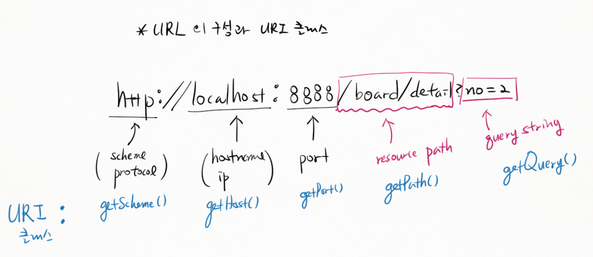

---
- 태그(tag) = 엘리먼트(element)
    - <시작태그>, <\/끝태그>
    - <태그명 속성명(attribute)='값'>

---
## 9/16
###### URL 인코딩(percent encoding)
- %00 형태로 인코딩 한다고 해서
- URL을 표현할 때 다음에 해당하는 문자는 %00 형태로 변환해야 한다.
- URL에 Query String으로 데이터를 보낸다면 다음의 문자를 %00 형태로 변환해야 한다.
1. 예약문자(reserved characters)
    - URL에서 특별한 의미로 사용되는 문자
    - `! * ' ( ) ; : @ & = +(=공백) $ , / ? # [ ]`
    - 예약문자를 그냥 일반적인 데이터로 보내고 싶다면 %00 형태로 인코딩 해야 한다.
2. 비예약문자
    - `대문자(A-Z), 소문자(a-z), 숫자(0-9), - _ . ~`
    - 인코딩이 필요없다.
3. 그 외 문자
    - %00 형태로 인코딩해야 한다.
    - 웹 브라우저와 서버가 자동으로 처리
    - 개발자가 신경쓸 필요가 없다.
    - 직접 웹서버를 만든다면 URL 디코딩을 직접 처리해야 한다.

- 인터넷이 처음 구축될 때 ASCII 코드를 주고 받도록 장비들이 최적화 되었다.
`(ASCII가 아닌)값 > 인코딩 > 7bit화 > 인터넷 > 7bit > 디코딩 > 값`

---
###### Command Design Pattern
- 게시판에 대한 새 요청 처리를 추가하기 위해서는 기존 코드를 변경해야 한다.
=> 게시글에 대해 새로운 요청처리를 추가할 때마다 기존 코드를 손대야 한다.
=> 버그가 추가될 가능성이 높아진다.
=> 앞으로 계속 새로운 요청(명령)이 추가될 가능성이 높은 경우
=> 기존 코드를 손대지 않고 해결하는 방법! **Command Design Pattern**
:: 명령을 처리하는 메서드를 객체화 `ex) BoardDetailHandler.java`

---
###### 애노테이션과 reflection API를 활용하여 커맨드객체 자동 생성
- java.lang.Class / java.lang.reflect.*
    - 클래스 정보를 조회하고 조작하는 도구
    - 수퍼클래스, 인터페이스, 필드, 생성자, 메서드의 상세 정보.
- 개발자가 사용하기 쉽게 포장한 것
    - `org.reflection.*` 라이브러리

---
## 9/19
- 모든 타입은 class라는 static 변수를 갖는다. (만들지 않아도!) (인터페이스, 애노테이션, 클래스 등)

---
##### 객체 생성 방법
1. String s = new String(); `기본 생성자`
2. String s2 = new String("Hello"); `파라미터`
3. Class<?> classInfo = Class.forName("java.lang.String"); `클래스 정보`
    - String x2 = classInfo.newInstance(); `deprecated (지양해야 할 방법)`
    1. 생성자를 알아낸다.
    `Constructor<?> c = classInfo.getConstructors()[0];`
    2. 생성자를 통해 인스턴스 생성
    `c.newInstance();`

---
- Servlet/JSP : 자바로 웹서버를 개발할 때 이런식으로하세요~
- 톰캣 내장 웹서버 / 톰캣 내장 어플리케이션

---
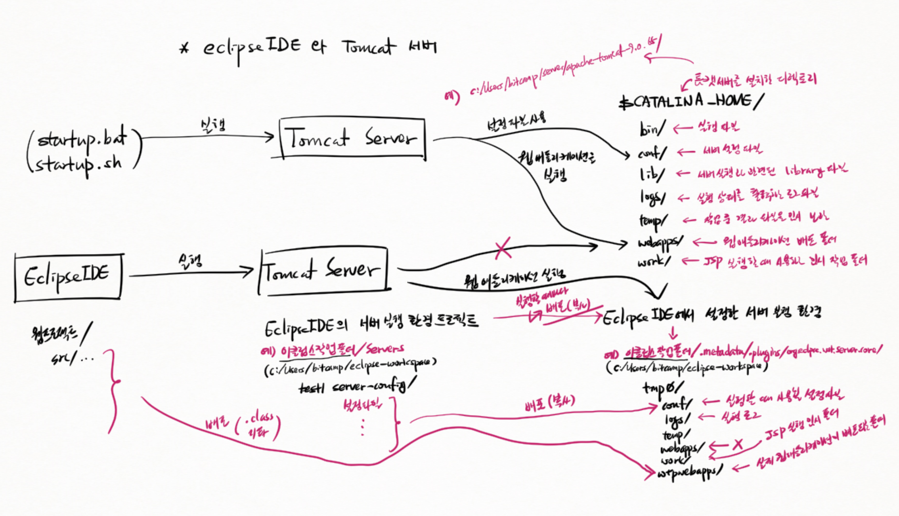

---
- build.gradle 변경
  - id 'eclipse-wtp' 플러그인 추가 : 웹 애플리케이션 관련 설정 파일을 추가로 생성한다.
  - id 'war' 플러그인 추가 : .war 배포 파일을 생성한다.

---
## 9/20
- 기업용 App 제작에 필요한 기술 (Java EE)
  - Servlet/JSP 기술 : 웹 애플리케이션 제작 자바 표준 기술
    - **Spring WebMVC Framework로 대체**
  - EJB : 분산 컴포넌트 제작 기술
    - (+) **Pure Java 기술로 객체 관리 : Spring Framework (서버가 필요 없다)**
  - Web Service : WSDL, SOAP, XML 등 웹서비스 구현 기술
    - **RESTful 기술로 대체 : JSON, Ajax**
  - 자원관리 및 공유 : **Spring Framework**

- 위의 것들을 위한 tool : **Spring Boot**

---
##### Java EE 기술과 구현 서버(implements)
- Java EE Implements (Java EE 구현 서버) : Java EE 기술 규격에 맞춰서 동작하도록 제작된 서버
  - Weblogic (Oracle) : 유
  - WebSphere (IBM)
  - JBOSS
  - JEUS
  - ...

- <u>**Java EE 기술 규격에 맞춰 제작된 App이라면 어떤 Java EE 서버에서도 실행할 수 있다.**</u>

---
- Java EE
  - Web App 개발 기술
    - Servlet/JSP
      - Tomcat 서버
      - Resin 서버
      - Jetty 서버
    - JSF, JSTL
      - 옵션

- Web Container `= Servlet Container` : Java EE 기술 중 Servlet/JSP 기술 규격만 지원하는 서버
  - Servlet : 실행
  - JSP : 실행
  - JSF : 라이브러리 추가 필요
  - JSP+JSTL : 라이브러리 추가 필요
  - EJB : 실행 불가
  - Web Service : 실행 불가

---
- Java EE 는 이클립스 재단에서 Jakarta EE 라는 이름으로 유지보수하고 있지만 아무도 사용하지 않는다.

---
- 서블릿 컨테이너에 배포하는 웹 애플리케이션의 디렉토리 구조
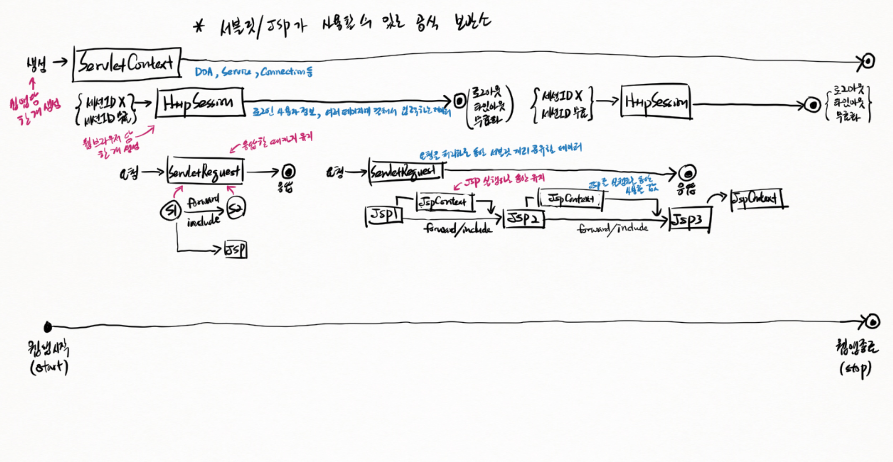

## 위에 12p 꼭 넣기

- DDFile : Deployent Descriptor File : 배치 설명 파일 (web.xml)

---
- 서블릿 컨테이너가 관리하고 실행하는 웹 애플리케이션 **컴포넌트**(부품)(객체)
  - 서블릿 : 요청 처리
  - 필터 : 서블릿 실행 전/후 보충작업
  - 리스너 : 서블릿 컨테이너가 특정 상태에 놓일때 실행
    - 특정 상태(이벤트(사건))
      - 요청 발생
      - 세션 생성, 소멸
      - 서버가 시작/종료
      - etc

---
## 9/21
- <\<interface\>> Servlet : HTTP 클라이언트 요청이 들어왔을 때 그 요청을 처리하는 객체에 대해 서블릿 컨테이너가 호출하는 메서드 규칙.
  - init()
    - 서블릿 객체가 작업할 때 사용할 자원을 준비시키는 코드를 둔다.
  - service()
    - 요청을 처리하는 코드를 둔다.
  - destroy()
    - 서버 종료 시 또는 웹앱 실행 중지 시에 호출된다.
    - 생성된 모든 서블릿에 대해서 호출된다.
    - init()에서 준비했던 자원을 해제시키는 코드를 둔다.
  - getServletInfo()
    - 서버 관리 화면을 실행할 때 호출된다.
  - getServletConfig()
    - 서블릿과 관련된 배치정보를 조회할 때 사용.

---
- 서블릿`Life Cycle`과 관련된 메서드 3종
  - init()
  - destroy()
  - service()

1. 요청
2. service()
  - 서블릿 객체는 최소 요청이 들어올 때 생성된다.
  - 오직 한 번만 생성한다. = 서블릿 객체는 한 개다.
  - init()도 한 번만 호출된다.
```
if (not exist) {
    서블릿 객체 생성 -> init()
}
service();
```

---
##### GenericServlet
- <\<abstract\>> GenericServlet
  - init(){}
  - destroy(){}
  - getServletInfo(){}
  - getServletConfig(){}
- 개발자의 편의를 위해 

---
##### <\<abstract\>> HttpServlet = GenericServlet + HTTP 프로토콜 정보를 다루는 메서드
- 실무에서 많이 쓴다.
`class HttpServlet extends GenericServlet`
- service(){}
  - doGet()
  - doPost()
  - doHead()
  - etc

---
## 9/22
##### 서블릿 객체 생성과 init()
1. 톰캣서버 관련 객체 생성
2. 웹 애플리케이션 관련 객체 생성
  - ServletContext
  - 서블릿 객체 준비 : `각각의 서블릿 객체에 대해 수행`
    - 단, `loadOnStartup` 설정이 되어 있는 경우.
    1. ServletConfig 객체 생성
    2. 서블릿 객체 생성 `생성자 호출`
    > 아직 ServletConfig 객체 주입 전!
    3. init() 호출 : ServletConfig 객체 주입

---
- 언제 서블릿 객체를 준비하는가
  1. `loadOnStartup` 설정된 경우 : 웹앱이 시작할 때
  2. 요청이 들어올 때(생성되어 있지 않다면)

---
- JWT : 기존의 세션 방식에 문제가 있어서 나온 방식
  - 기존 방식 문제 : 토큰을 무효화 시키는데 그게 무효화가 안됨. -> 토큰 무효화 코드를 추가로 작성해야 한다.


---
- 서블릿/JSP가 사용할 수 있는 공식 보관소


#### 객체 LifeCycle
- ServletContext : 웹앱당 한 개 생성 / 웹앱 종료시 소멸
  > DAO, Service, Connection 등
- HttpSession : 웹 블우저 당 한 개 생성(보통 그렇다, chrome은 제외) / 로그아웃/타임아웃/무효화 시 소멸
  > 로그인 사용자 정보, 여러 페이지에 걸쳐서 입력하는 데이터
- ServletRequest : 요청시에 생성 / 응답할 때까지 유지
  - forward 랑 include 쓰는 servlet은 같은 ServletRequest 객체를 공유한다.
  > 요청을 처리하는 동안 서블릿끼리 공유할 데이터
- JspContext : JSP 실행하는 동안만 유지
  > JSP를 실행하는 동안 사용할 값

---
##### Listener
- 자원을 서블릿이 준비하거나 리스너가 준비하거나 중에 하나입니다~
- <\<interface\>> ServletContextListener : `ServletContext`가 생성 / 소멸 될 때
- <\<interface\>> ServletRequestListener : `ServletRequest`가 생성(요청이 들어올 때) / 소멸(응답을 완료할 때) 될 때
- <\<interface\>> HttpSessionListener : `HttpSession`이 생성 / 소멸 될 때

---
- `ContextLoaderListener` 클래스
  - `contextInitializaed(){}` : `Servlet`/`Filter` 등에서 공유할 자원을 준비하여 `ServletContext`에 보관한다.
  - `contextDestroyed(){}` : `ServletContext`에 보관된 자원 중에서 명시적인 해제가 필요한 자원에 대해 메모리해제 작업을 수행한다.

---
### JSP
- [요청] -> `Tomcat Server` -> 요청 -> `welcome.jsp` -> jsp엔진이 변환 -> `*.java` -> java컴파일러 -> *.class
  > jsp 엔진 : 컴파일러
  > *.java : 서블릿 구현체
  > *.class : 서블릿 클래스

---
##### JSP Template
1. JSP Template `= 자바 소스 코드를 만드는 틀로서 사용`
  > 출력할 콘텐트

2. JSP Template Engine 에 의해 변환
3. 서블릿 클래스
  > 자바 소스 파일

---
##### Template engine

```
md, Thymeleaf, FreeMarker, JSP
가 HTML문서로 변환되고
이는 Web Browser로 송출된다.
```

- JSP, Thymeleaf, FreeMarker 는 Spring WebMVC Framework 에서 사용.
> JSP와 Thymeleaf 주로 사용.

---
- JavaScript의 템플릿 엔진을 TypeScript도 쓴다. 그래서 TS를 JS로 변환해서 JS엔진으로 실행한다.

---
##### JSP 문법 요약
- jsp 문법 -> 변화? -> 자바 소스 
- `일반 텍스트` -> 변환 -> `out.write("일반텍스트");`
- <% `자바코드` %> -> 복사 -> `자바 코드`
  > jsp의 자바 코드 : `scriptlet`
- <%@ `태그 및 속성` %> -> 변환 -> `자바 코드`
  > jsp의 태그 및 속성 : `directive element`
- <%! `필드 및 메서드 선언` %> -> 복사 -> `필드 및 메서드 선언`
  > jsp의 필드 및 메서드 선언 : `declaration element`
- <%= `표현식(expression)` %> -> 변환 -> `out.print(표현식);`
  > jsp의 표현식 : `expression element`
- <jsp:태그 속성=값 ...\/> -> 변환 -> 자바 코드
  > JSP Action Tag(jsp 전용 태그)

---
##### MVC 모델1 과 MVC 모델2
- MVC : **M**odel **V**iew **C**ontroller
  - Model
    > 업무로직 수행
    > DAO, Service, ...etc
    > 요청/응답에 필요한 작업을 수행한다.
  - View
    > UI생성
    > Controller가 준비한 데이터를 가지고 출력 UI 생성
  - Controller
    > [요청 제어]
    > 요청을 처리하기 위해 요청정보를 가공하고 적절한 서비스객체(DAO객체)를 실행
    > 응답을 처리하기 위해 응답 데이터를 가공하여 출력을 담당하는 객체를 실행한다.

1. MVC 모델1
  - `web browser` >요청> `JSP` >call> `Java` >질의> `DBMS`
  - `java` >생성> `Domain객체`
  > `java` : Model
  > `JSP` : Controller 겸 View
  > `java/Domain객체` : VO객체(Value Object), DTO객체(Data Transfer Object)

2. MVC 모델2 : 현업에서 쓰인다. : MVC1모델의 JSP를 Servlet과 JSP로 분리.
  - `web browser` >요청> `Servlet` >call> `DAO, Service, ...` >질의> `DBMS`
  - `Servlet` >위임> `JSP`
  > `Servlet` : Controller
  > `JSP` : View

---
## 9/23
#### use-case 모델링 - 요구사항 식별
###### actor : 우리 시스템을 사용하는 사람이나 **프로세스** `= 외부 시스템`를 가리킨다.
1. 주액터와 보조액터
- Primary Actor : 시스템을 사용하는 액터
- Secondary Actor `= Supplementary Actor` : 우리가 개발할 시스템이 사용하는 외부 시스템

2. Actor의 관계
- super actor : `회원`
- sub actor : `학생`
  > 상속 관계
  > 서브 액터는 수퍼 액터의 역할을 포함한다.
  > 즉 수퍼액터가 사용할 수 있는 기능을 서브 액터도 사용할 수 있다.

###### Use-case 식별
- use-case : actor가 시스템을 사용하여 처리하고자 하는 업무 (사용사례 `지양할 표현`)

###### use-case 식별 지침서(권고)
1. 시스템을 통해 수행하는 업무 (우리 시스템을 사용해서 하는 특별한 것.)
  > 로그인, 로그아웃 `= 사용자인증`은 업무가 아니므로 use-case가 아니다.

2. 한 Actor가 수행하는 업무
3. 한 번에 한 순간에 수행하는 업무 `= 셀 수 있는 업무`
> 1주~4주 사이에 개발할 수 있는 규모로 시스템의 기능을 쪼갤 수 있다.
> 프로젝트 관리가 용이한 규모로 개발할 시스템의 기능을 정의할 수 있다.

###### use-case 실무
1. 서로 관련된 use-case인 경우 한 개의 use-case로 합칠 수 있다.
2. CRUD use-case들을 하나의 use-case로 합칠 수 있다.
> 너무 use-case를 잘게 쪼개면 오히려 관리하기 번거롭다.
> 단 합쳤을 때 use-case의 개발 기간이 4주 안팎인 것이 좋다.
3. 여러 use-case의 공통 시나리오인 경우 별도의 use-case로 뽑을 수 있다.
> 로그인 하기는 비록 업무는 아니지만 여러 use-case에 포함된 작업이다.
> 공통기능으로 분리하여 개발할 수 있게 별도의 use-case로 뽑아낸다.

###### use-case 관계
1. 포함관계(include) : 필수
    - B업무를 수행하지 않고는 A업무를 완료할 수 없다. **"필수"**
2. 확장관계(extend) : 선택
    - `extension point (확장점)`
- 포함/확장 관계를 명시적으로 표시하는게 이해에 도움이 될 때 그려라.
굳이 그리지 않아도 관계를 유추할 수 있다면 그러지 말자.

---
- use-case : Servlet = 1 : *
> 한 개의 usecase는 한 개 이상의 서블릿`Controller`으로 구현한다.

###### 요구사항 정의 -> 설계 -> 구현 -> ... ; Development Process
0. 업무 분석
1. 요구사항 정의
    - use-case 명세서(text)
    - 기능/비기능 명세서
    - UI prototype

2. 설계
    - Class Diagram
    - Sequence Diagram
    - Collaboration Diagram
    - ER Diagram
    - Activity Diagram
    - \+ Participant Diagram

3. 구현
    - 구현자(implementer)
    - 프로그래밍 코드

---
###### 프로젝트에 use-case Modeling 적용
1. actor 식별
2. 각 actor에 대해 use-case 식별
3. 각 use-case에 대해 UI prototype 작성

---
---
- declaration element
> <%!
int x = 300;
void m(){}
%>

- scriptlet
- template data
- directive element

---
###### JSP 파일로 서블릿 클래스를 만들 때 지켜야할 조건
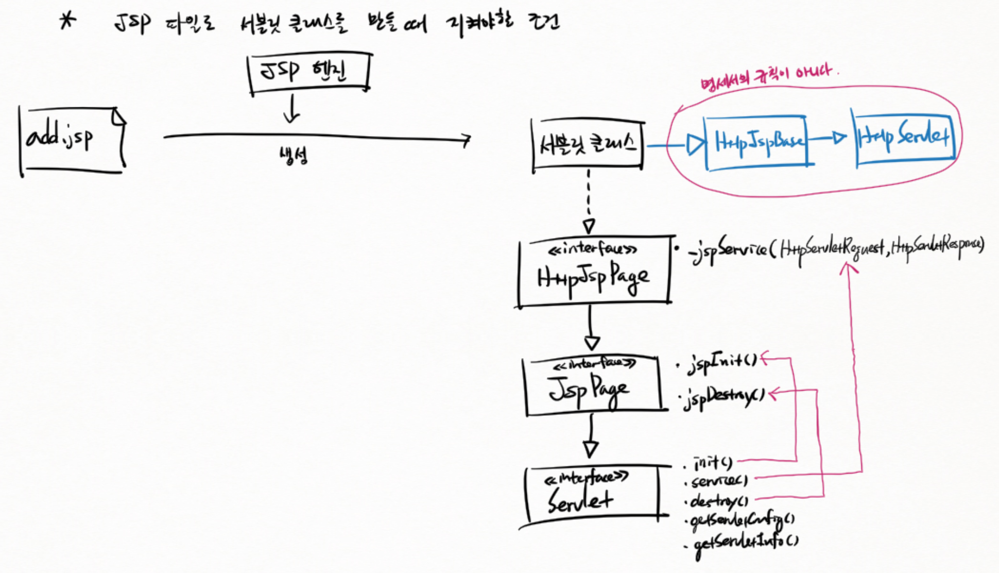

---
## 9/26
###### include / forward
1. include
    > `출력1 > include > 출력2 > 출력3`
    > 응답 : 출력1 + 출력2 + 출력3
    > ServletRequest 보관소와 `setAttribute()`와 `getAttribute()`로 데이터를 넣거나 가져올 수 있다.
2. forward
    > `출력1 > forward > 출력2 > 출력3`
    > 응답 : 출력2
    > forward 하기 전에 기존 출력을 버린다. : 출력1
    > forward에서 리턴한 후에 출력한 것을 무시한다. : 출력3
    > ServletRequest 보관소와 `setAttribute()`와 `getAttribute()`로 데이터를 넣거나 가져올 수 있다.

---
#### JSP Built-in 객체
- JSP 파일을 가지고 서블릿 자바 코드를 생성할 때 기본으로 준비하는 객체.
- 객체의 이름은 명세서에 정해져 있다.

###### Built-in 변수
- 명세서에 이름이 정해져 있다. 
- JSP엔진 마음대로 이름을 바꿀 수 없다.
```
PageContext pageContext = ;
HttpSession session = ;
ServletContext application = ;
ServletConfig config = ;
JspWriter out = ; 
Object page = this;
Throwable exception = ;
```


---
###### Refresh와 Redirect
- Refresh는 client에게 **콘텐트를 보낸다!**
- Redirect는 **콘텐트를 보내지 않는다!**

---
- EL(**E**xpression **L**anguage)
- OGNL 표기법을 사용하여 객체의 프로퍼티 값을 조회
    - **O**bject **G**raph **N**avigation **L**anguage
    > 객체, 

> ${객체.프로퍼티.프로퍼티.프로퍼티. ...}
> ${requestScope.board.title}

---
- EL의 기본객체
    1. applicationScope(ServletContext 보관소)
    2. sessionScope(HttpSession 보관소)
    3. requestScope(servletRequest 보관소)
    4. pageScope(pageContext(JspContext) 보관소)
    - ${board.title} 이라고 쓰면 4~1의 역순으로 알아서 찾는다.

- 필드와 프로퍼티
    - 필드 : field
    - property명 : `setTitle(){}`이라면 `title` 부분이 property 명
        - setter
        - getter
        > 이 `getter` `setter` 이름이 중요한거지 필드명은 중요치 않다! 관례상 필드명앞에 get과 set을 붙여서 getter와 setter를 만들 뿐.

---
## 9/27
- 클라이언트에서 세션ID 를 보내주지 않으면 새로 생성
- 클라이언트가 보낸 세션ID가 무효하다면

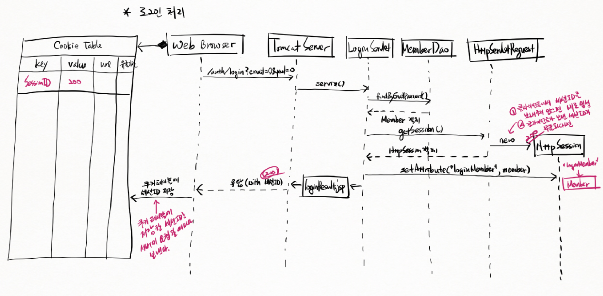

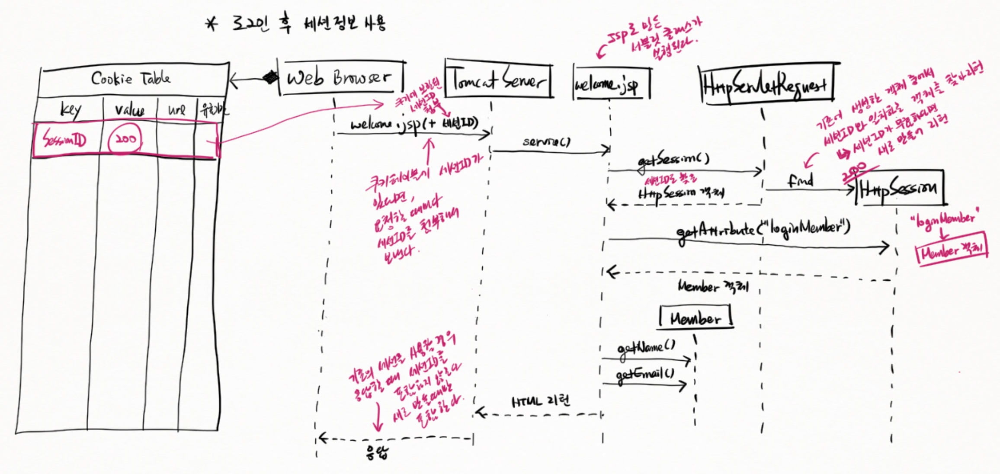

---
## 9/28
- PageContext : JSP와 태그 핸들러 사이에 객체를 공유할 때 사용하는 저장소

---
- 서버 저장소
    - ServletContext : DAO, Service, Connection
    - HttpSession : 로그인 사용자, 입력값
    - ServletRequest : 요청처리결과
    - PageContext : EL에서 사용할 객체

---
- **Cookie** : 서버에서 클라이언트 저장소에 보관할 데이터
    - 서버로부터 받은 쿠키를 클라이언트에서 다시 서버로 보내는 방법
    > Cookie : `email=user1@test.com; name=okok`
    > 이 부분은 웹브라우저가 자동으로 처리한다.
    > <br>
    > Set-Cookie : `email=user1@test.com`
    > 이 부분은 개발자의 코딩이 필요!

    - 쿠키는 클라이언트 쪽에 저장되기 때문에 쉽게 노출된다.
    > 따라서 보안데이터는 쿠키로 저장하면 안 된다.

---
- /auth/에 소속된 서블릿으로부부터 받은 쿠키는 같은 /auth/에 소속된 서블릿을 요청할 때만 서버로 보낸다.
> 모든 경로에 대해서 쿠키를 보내게 되면 주고받는 데이터 크기가 너무 커진다.

---
##### 게시글에 작성자 이름을 포함하기
- 방법1 : Domain:Board 에 작성자 이름을 저장할 필드 추가
- 방법2 : Domain:Board가 Domain:Member 를 포함하게끔.
> 작성자 이름을 객체에 담아서 추가


---
## 9/29
- <<interface\>> Filter
    - init()
    - doFilter()
    - destroy()

- 필터배치 두가지 방법 `필터배치(deployment)`
    1. 애노테이션
    @WebFilter(url)
    > 자기가 만든 필터
    > 소스 갖고 있음
    > 애노테이션 붙일 수 있음

    2. DD File(web.xml)
    <filter\> - </filter\>
    <filter-mapping\> - </filter-mappiing\>
    > 남이 만든 필터 클래스
    > 소스 없음
    > 애노테이션 붙일 수 없음

> 필터배치(deployment)
> 이런 필터가 있는데 이런 요청이 들어올때 실행하라고 웹 어플리케이션에 설정하는 것!
> 서블릿 컨테이너는 배치된 컴포넌트만 관리한다.
> <br>
> 컴포넌트 : 필터, 서블릿, 리스너, etc

---
##### HTTP GET 요청
- Request Line 한줄
> GET `/app/auth/login` `?` `email=user1@test.com&password=1111&saveEmail=on` HTTP/1.1
> 
> `/app...=on` : Request URI(URL or URN)
> `/app/auth/login` : Path
> `email=...=on` : '파라미터명'과 '파라미터 값'으로 이루어진 Query String(서버에 보내는 데이터)

- general-header : 요청, 응답에 모두 붙일 수 있는 헤더
> Cache-Control, Connection

- request-header : 요청과 관련된 정보
> Accept
> Accept-Encoding
> Host : 요청을 받는 서버
> User-Agent : 요청을 보내는 브라우저 정보

- entity-header : message-body 로 보내는 데이터에 대한 정보 : `POST` 요청시에 추가된다.
> Content-Length
> Content-Type

- GET 요청은 message-body가 없다
- entity-header가 없다
- Query String 형태로 데이터를 URL에 포함해서 보낸다.
    > 단점
    > - 텍스트만 가능(binary 보내기 힘듦)
    > - 주소창에 노출(보안취약)
    > - 웹브라우저는 URL을 캐시에 저장(보안 매우 취약)
    > <br>
    > 장점
    > - URL에 데이터를 포함시킬 수 있다.
    > **특정 콘텐트를 조회하는 페이지를 가리킬 때 적절하다.**

---
##### POST 요청
> POST `/app/auth/login HTTP/1.1` : URL에 데이터가 포함되지 않는다.
> <br>
> 장점
> - message-body 영역에 붙여서 보냄
> - 보내는 데이터의 크기에 제약 없음
> - binary 데이터를 보낼 수 있음
> - URL에 데이터가 포함되지 않기 때문에 직접 노출되는 것을 막을 수 있다.
> = 보안에 유리
> - 웹 브라우저가 캐시하지 않는다.
> = 보안에 유리
> <br>
> 대용량의 데이터 전달에 적합
> = 게시글/첨부파일을 등록/변경, 로그인 데이터 전달에 적합하다.

---
- POST 방식 요청에서 한글이 꺠지는 이유
    - UTF-8 한글 코드를 ASCII코드와 같은 방식으로 UTF-16코드로 변환해서 문제가 발생한다.
- 해결책
    - URL 디코딩한 바이트를 UTF-16코드로 변환하기 전에 원래 바이트가 어떤 characterset으로 인코딩된 것인지 알려줘라!
    - request.setCharacterEncoding("UTF-8")
    > getParameter()를 최초로 호출하기 전에 먼저 실행
    > 

---
## 9/30
- 파일 업로드
<form action="" method="post" enctype="multipart/form-data"\>
파일: <input type="file" name="files"\>
</form\>

> 파일을 전송하려면 `enctype=...data"`처럼 이렇게 MIME타입을 설정해야 한다.
> 기본은 `application/x-www-form-urlencoded` 이다.
> 이름=값&이름=값&... 형태로 데이터를 전송한다.


---
- 업로드 파일 처리
1. apache commons-fileupload 사용
2. Servlet API 사용
3. Spring WebMVC 사용

---
## 10/4
- 한 개의 DAO가 한 개의 테이블을 관리하는 것이 기본이다.
- 복잡하지 않다면 한 개의 DAO가 여러 테이블의 데이터를 관리할 수 있다.
- 여러 DAO가 한 개의 테이블을 관리(owner)하면 안 된다.
- 하지만 조회(select)할 수는 있다.